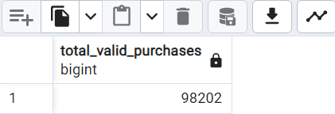

# ShopEasy Case Study — A. Purchase Metrics

## Q1: What counts as a valid purchase?

A valid purchase is defined as:
- Order where `order_approved_at IS NOT NULL` and status is in `approved`, `invoiced`, `processing`, `shipped`, or `delivered`
- OR status is `delivered` even if approval date is missing (possible logging error)

### SQL

```sql
WITH valid_orders AS (
  SELECT *
  FROM orders
  WHERE (
    order_approved_at IS NOT NULL
    AND order_status IN ('approved', 'invoiced', 'processing', 'shipped', 'delivered')
  )
  OR (
    order_approved_at IS NULL
    AND order_status = 'delivered'
  )
)
SELECT COUNT(*) AS total_valid_purchases
FROM valid_orders;

### Answer: 



- ✅ Total of 92,099 valid purchases  
- Based on:
  - `order_approved_at IS NOT NULL` **and** status in `approved`, `invoiced`, `processing`, `shipped`, `delivered`
  - OR status is `delivered` even if `order_approved_at IS NULL` (possible logging delay)


