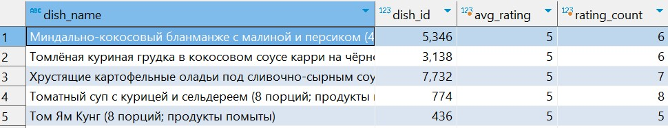

# Case Study 2: Client Satisfaction

## Business Problem


## Questions Answered
1. Which dishes receive the lowest and highest ratings?

## Folder Structure
- `data/` – CSV files or raw data (if needed)
- `solutions/` – Contains `client_satisfaction_analysis.sql` with all queries and answers


## Question and Solution

## Q1: Which dishes receive the lowest and highest ratings?

Relevant Table(s)
order_dish_rates

Step 1: Inspect the Columns

```sql
SELECT * 
FROM order_dish_rates
LIMIT 1;
```

Based on the structure of the table the relevant fields are:
- id
- rate
- comment
- dish_id
- order_id
- client_id
- platform_id
- created_at
- updated_at


Step 2: Top 5 Highest Rated Dishes (2024–2025)

```sql
SELECT
  m.name AS dish_name,
  r.dish_id,
  ROUND(AVG(r.rate)::numeric, 2) AS avg_rating,
  COUNT(*) AS rating_count
FROM order_dish_rates r
JOIN menu m ON r.dish_id = m.dish_id
WHERE r.rate > 0
  AND r.created_at BETWEEN '2024-01-01' AND '2024-12-31'
GROUP BY m.name, r.dish_id
HAVING COUNT(*) >= 5
ORDER BY avg_rating DESC
LIMIT 5;
```

Top 5 Highest Rated Dishes 2024



Top 5 Highest Rated Dishes 2025


