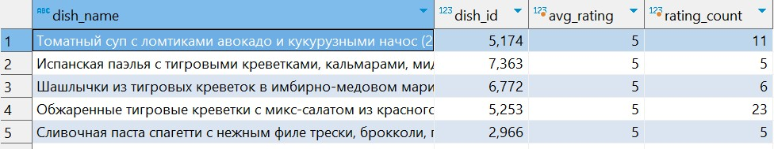
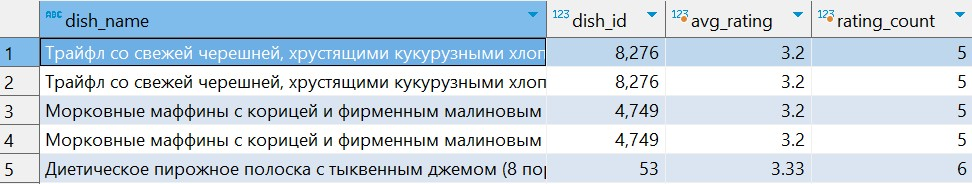
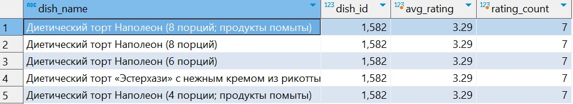
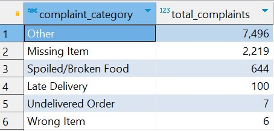

# Case Study 2: Client Satisfaction

## Business Problem


## Questions Answered
1. Which dishes receive the lowest and highest ratings?
2. What are the top complaints or claims raised by clients?
3. Analyze the reasons for canceled orders.

## Folder Structure
- `data/` – CSV files or raw data (if needed)
- `solutions/` – Contains `client_satisfaction_analysis.sql` with all queries and answers


## Question and Solution

## Q1: Which dishes receive the lowest and highest ratings?

Relevant Table(s)
order_dish_rates

Step 1: Inspect the Columns

```sql
SELECT * 
FROM order_dish_rates
LIMIT 1;
```

Based on the structure of the table the relevant fields are:
- id
- rate
- comment
- dish_id
- order_id
- client_id
- platform_id
- created_at
- updated_at


Step 2: Top 5 Highest Rated Dishes (2024–2025)

```sql
SELECT
  m.name AS dish_name,
  r.dish_id,
  ROUND(AVG(r.rate)::numeric, 2) AS avg_rating,
  COUNT(*) AS rating_count
FROM order_dish_rates r
JOIN menu m ON r.dish_id = m.dish_id
WHERE r.rate > 0
  AND r.created_at BETWEEN '2024-01-01' AND '2024-12-31'
GROUP BY m.name, r.dish_id
HAVING COUNT(*) >= 5
ORDER BY avg_rating DESC
LIMIT 5;
```

Top 5 Highest Rated Dishes 2024


Top 5 Highest Rated Dishes 2025


Step 3: Top 5 Lowest Rated Dishes (2024–2025)

```sql
SELECT
  m.name AS dish_name,
  r.dish_id,
  ROUND(AVG(r.rate)::numeric, 2) AS avg_rating,
  COUNT(*) AS rating_count
FROM order_dish_rates r
JOIN menu m ON r.dish_id = m.dish_id
WHERE r.rate > 0
  AND r.created_at BETWEEN '2024-01-01' AND '2024-12-31'
GROUP BY m.name, r.dish_id
HAVING COUNT(*) >= 5
ORDER BY avg_rating asc 
LIMIT 5;
```

Top 5 Lowest Rated Dishes (2024)


Top 5 Lowest Rated Dishes (2025)


## Q2: What are the top complaints or claims raised by clients?

Relevant Table(s)
claims


Step 1: Inspect the Columns

```sql
SELECT column_name
FROM information_schema.columns
WHERE table_name = 'claims';
```


Based on the structure of the table the relevant fields are:
- claim_position_type_id
- claim_client_service_call_type_id
- claim_result_type_id
- claim_status_id
- comment (for qualitative analysis)
- created_at (for date filtering)

These likely reference lookup tables like:
- claim_position_types
- claim_result_types
- claim_statuses
- claim_client_service_call_types

Step 2: What are the top complaints or claims raised by clients?
Understanding client complaints is essential for improving service quality, reducing churn, and prioritizing internal improvements. However, in our database, there’s no predefined column for “complaint category.” Instead, all client complaints are written as free-text comments in the claims.comment field.

| Category              | Example Keywords Detected From Comments                |
|-----------------------|--------------------------------------------------------|
| Late Delivery         | опоздал, задерж, позже                                 |
| Missing Item          | не положили, не было, отсутств                         |
| Wrong Item            | не тот, перепутали                                     |
| Undelivered Order     | не доставили, не пришел, не приехал                    |
| Spoiled/Broken Food   | испорчен, протек, плохой                               |
| Cold Food             | холодн, остыл                                          |
| Other                 | Used when none of the above keywords are found         |


```sql
SELECT
  CASE
    WHEN comment ILIKE '%опоздал%' OR comment ILIKE '%задерж%' OR comment ILIKE '%позже%' THEN 'Late Delivery'
    WHEN comment ILIKE '%не положили%' OR comment ILIKE '%не было%' OR comment ILIKE '%отсутств%' THEN 'Missing Item'
    WHEN comment ILIKE '%не тот%' OR comment ILIKE '%перепутали%' THEN 'Wrong Item'
    WHEN comment ILIKE '%не доставили%' OR comment ILIKE '%не пришел%' OR comment ILIKE '%не приехал%' THEN 'Undelivered Order'
    WHEN comment ILIKE '%испорчен%' OR comment ILIKE '%протек%' OR comment ILIKE '%плохой%' THEN 'Spoiled/Broken Food'
    WHEN comment ILIKE '%холодн%' OR comment ILIKE '%остыл%' THEN 'Cold Food'
    ELSE 'Other'
  END AS complaint_category,
  COUNT(*) AS total_complaints
FROM claims
WHERE created_at BETWEEN '2024-01-01' AND '2025-12-31'
  AND comment IS NOT NULL
GROUP BY complaint_category
ORDER BY total_complaints DESC;
```

Top complaints or claims (2024-2025)



## Q2: Analyze the reasons for canceled orders

Step 1: Inspect the list of all available columns in the orders table

```sql
SELECT column_name
FROM information_schema.columns
WHERE table_name = 'orders'
ORDER BY column_name;
```

Now we’re working with a verified, real column list from orders where order_status_id = 16 means canceled


Step 2: Order Cancellation Reason Analysis

```sql
SELECT
  order_cancel_type_id,
  COUNT(*) AS total
FROM orders
WHERE order_status_id = 16
  AND created_at BETWEEN '2024-01-01' AND '2025-12-31'
GROUP BY order_cancel_type_id
ORDER BY total DESC;
```

While analyzing canceled orders from 2024–2025 (order_status_id = 16), we discovered:

- **700 canceled orders** fall within the selected time range.
- However, the `order_cancel_type_id` field is **NULL** for all these records.
- This indicates that cancelation reasons were either not recorded or stored elsewhere in the system.

